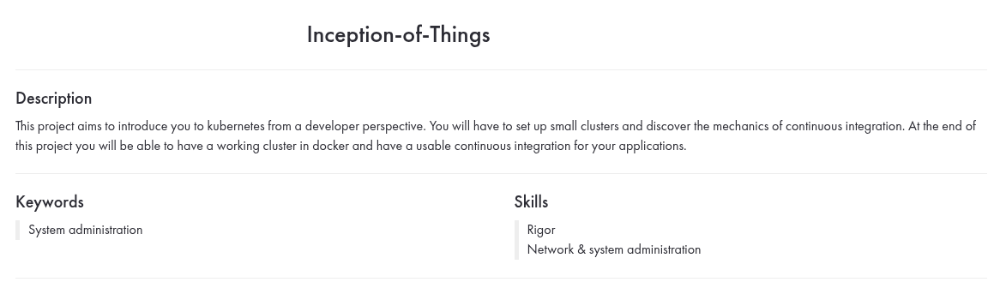
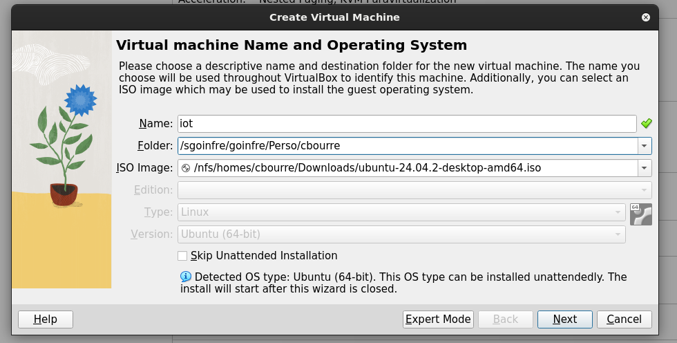
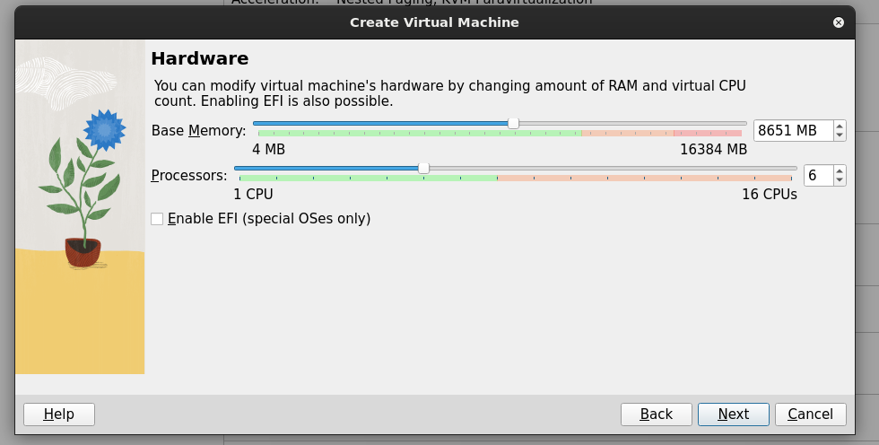
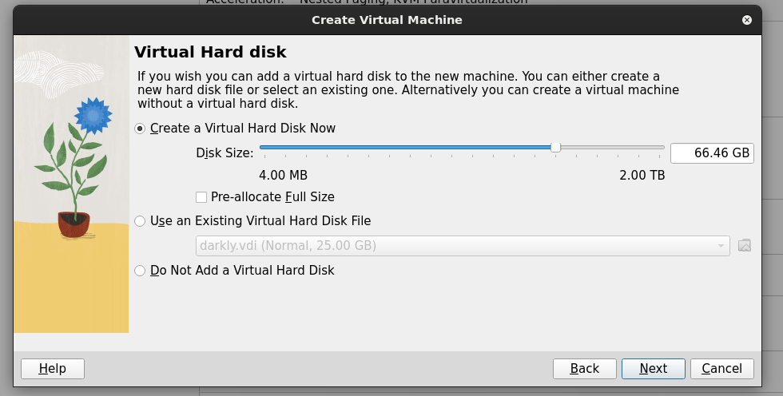
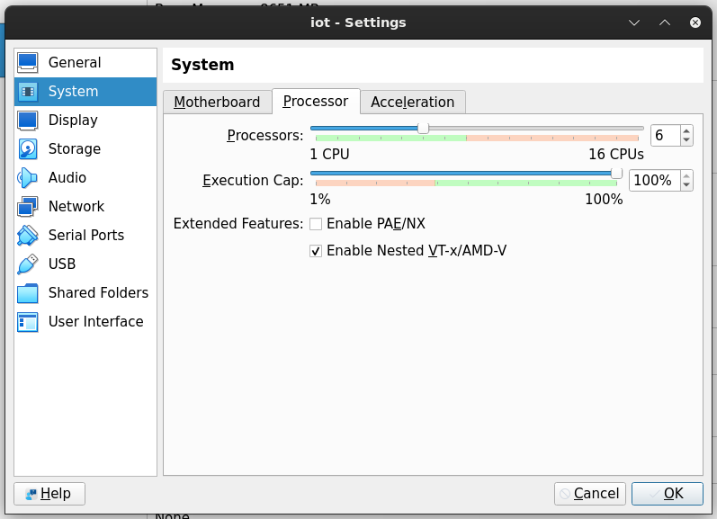

# Inception of Things

Mate: **[pirabaud](https://github.com/Pirabaud)**

Score: **%**

## First Steps

This project must be done on our own Virtual Machine !

This will be our VM's configuration :

We chose to use **Ubuntu 24.04.2**

The tricky thing is that *Inception of Things* asks you to create <ins>2 VMs with Vagrant</ins>.
In order to do that, don't forget to set up properly your HostVM.

When it's done, you'll need to install [Vagrant](https://developer.hashicorp.com/vagrant/install)

